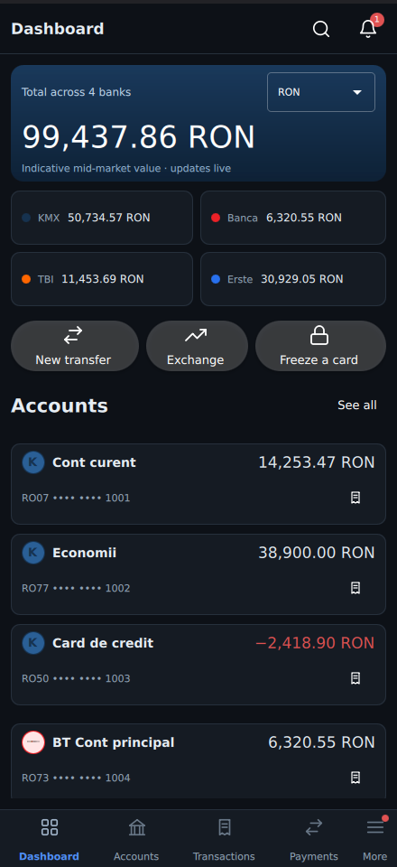
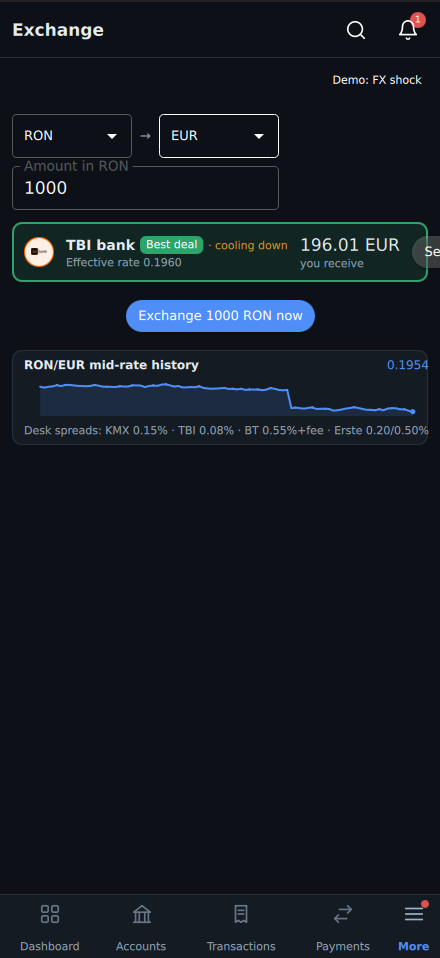
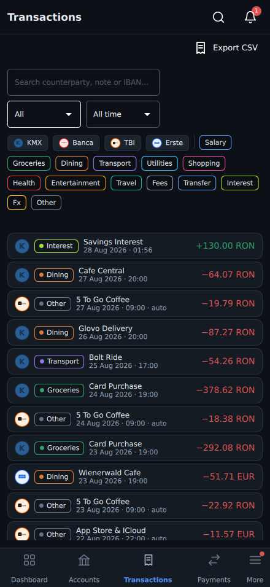

# KMX — iBanking Demo

| Dashboard | Exchange | Transactions |
|---|---|---|
|  |  |  |

<sub>Mobile shell, `--device=ultra` preset (411×891 canvas).</sub>

A Qt Quick + C++ **internet-banking demo** built around a *meta-banking*
concept: one app that aggregates accounts from several banks and guides you
to the cheapest way to exchange currency across them.

Everything runs on a deterministic simulated backend — no networking, no real
banks — while behaving like a real open-banking aggregator: per-bank
connectors with different quirks, sync schedules, session expiries and rate
limits.

Built and run inside the project's dev image (`Dockerfile`): the upstream
`dalogik/qt-docker:qt6.11.0-linux64-gcc` plus **clang-20**, which is what lets
the code build at **C++26** (`-std=c++26`). The bundled GCC 13 tops out at
C++23, so `CMakeLists.txt` probes the compiler and falls back automatically —
both toolchains build warning-free and pass the full suite.

The C++ follows the KMX house style (CSCG-2025-07): `snake_case` throughout,
Allman braces, Doxygen on public declarations, `#ifndef PCH` include guards,
enforced by the checked-in `.clang-format`.

## Feature tour

| Area | Highlights |
|---|---|
| **Authentication** | Login → password → 6-digit OTP (simulated SMS card), 30 s lockout after 5 failures, 5 min idle auto-lock, `Ctrl+L` manual lock |
| **Bank linking** | Connect BT / TBI / Erste through an onboarding wizard (picker → credentials → consent); per-bank status, re-auth flows, rate-limit feedback |
| **Dashboard** | Cross-bank net worth with live FX walk, per-bank subtotals, account cards with sparklines, budget snapshot, **smart-exchange insight cards** |
| **Transactions** | Full cross-bank ledger: search (diacritics-insensitive), category/bank/date filters, detail sheet with manual recategorization, CSV export |
| **Payments** | Transfer wizard with IBAN checksum feedback, receipts, monthly standing orders (capability-gated per bank) |
| **Exchange** | **Smart routing**: ranks every connected bank's FX desk (direct + two-leg routes), explains why, executes into your own pockets |
| **Cards** | Flip-to-reveal PAN/CVV, freeze blocks transfers from that account, daily limits, virtual cards |
| **Analytics** | Spending donut, cashflow bars, net-worth trend, budget envelopes with once-a-month over-budget alerts |
| **i18n** | English + Romanian, live language switch, locale-aware money/date formatting |

Demo scenario triggers live in the floating **Demo** button (salary, fraud
alert, FX shock, BT session expiry, standing-order run).

## Demo credentials

Any non-empty username and password. The OTP code appears in the simulated
"SMS" card inside the verification dialog (with an Autofill button).

## Project layout

```
src/domain/      money (qint64 minor units), currency_code, entities, seeded
                 world, MOD-97 IBAN helpers
src/connectors/  bank_connector + per-bank implementations (quirk matrix)
src/services/    auth, connections, accounts, payments, cards, fx,
                 exchange advisor, analytics, budgets, notifications
src/viewmodels/  banking_session facade + list models + filter proxy
src/app/         ui_config: desktop/mobile start-up switch + device presets
qml/             shell/ (desktop) mobile/ (handset) pages/ components/
                 theme/ auth/ — one page set, two shells
tests/           12 Qt Test suites, headless via CTest
docs/            DEVELOPMENT_PLAN.md · BANKING_DEMO.md (demo storyboard)
```

## Architecture in one paragraph

`main.cpp` builds a deterministic world (fixed-seed generator, injectable
clock) and wires services behind a single `banking_session` QObject injected
into QML as `bank`. Bank-specific behavior lives behind `bank_connector`;
everything downstream sees normalized DTOs. Money never touches `double` —
all arithmetic is integer minor units with explicit rounding at conversion
points, and the exchange advisor's route ranking is verified against an
independent brute-force oracle in the test suite.

## Build & run (Docker)

```bash
chmod +x scripts/container-build-run.sh
./scripts/container-build-run.sh
```

Software-rendering fallback:

```bash
USE_SOFTWARE_RENDERING=1 ./scripts/container-build-run.sh
```

## Desktop and mobile shells

The app ships two shells over one set of pages. `MainShell` is the desktop
layout (sidebar + header + page stack); `MobileShell` is the handset layout
(top bar + full-bleed page stack + bottom navigation, with the overflow
destinations in a "More" sheet). Both drive the same `RouteHost`, the same
pages and the same `banking_session`, so a page is written once.

Which one starts is decided at launch, in this order: `--ui`, then `KMX_UI`,
then the remembered choice, then auto-detection (mobile on Android/iOS or a
sub-600px primary screen). Only an explicit choice is remembered — an
auto-detected one is never written back, so a one-off `--ui=mobile` does not
become sticky. Settings › Interface writes the preference for the next start.

```bash
./scripts/container-run-only.sh --ui=mobile                 # handset shell
./scripts/container-run-only.sh --ui=mobile --device=budget # a specific panel
./scripts/container-run-only.sh --ui=desktop
./scripts/container-run-only.sh --list-devices
KMX_UI=mobile KMX_DEVICE=ultra ./scripts/container-run-only.sh
```

Device presets describe real panels by their physical pixel grid and density.
Layouts never see those numbers: the canvas is the grid divided by the device
pixel ratio, which is what `--list-devices` prints in the last column.

| key | tier | physical | ppi | dpr | canvas |
|-----|------|----------|-----|-----|--------|
| `ultra` | ultra flagship QHD+ | 1440×3120 | 505 | 3.5 | 411×891 |
| `ultra-xl` | ultra flagship QHD+ tall | 1440×3200 | 520 | 3.5 | 411×914 |
| `flagship` | mainstream flagship | 1320×2868 | 460 | 3.0 | 440×956 |
| `flagship-compact` | mainstream flagship compact | 1284×2778 | 458 | 3.0 | 428×926 |
| `sweetspot` | upper mid-range 1.5K | 1240×2772 | 450 | 3.0 | 413×924 |
| `sweetspot-wide` | upper mid-range 1.5K | 1264×2780 | 460 | 3.0 | 421×927 |
| `budget` | budget FHD+ | 1080×2400 | 395 | 2.75 | 393×873 |
| `budget-tall` | budget FHD+ tall | 1080×2412 | 400 | 2.75 | 393×877 |

On a real handset the actual screen wins and the window goes full-screen. On a
desktop the preset sizes the preview window and pins it there — minimum equals
maximum, so it has no resize handle, exactly like the panel it stands in for.
Switch presets with `--device` (or Settings › Interface) rather than by
dragging.

Pages reflow off the `FormFactor` singleton's size class — `compact` (≤599px
canvas), `medium` (≤904px) and `expanded` — never off a raw window width. Every
preset lands in `compact`; the desktop shell spans `medium` to `expanded` as
its window is resized.

## Tests

```bash
./scripts/container-start.sh
./scripts/container-enter.sh
cmake -S /workspace -B /workspace/build -G Ninja        # picks clang-20 / C++26
cmake --build /workspace/build -j"$(nproc)"
ctest --test-dir /workspace/build --output-on-failure   # headless
```

To build with the image's GCC instead (C++23 fallback path):

```bash
cmake -S /workspace -B /workspace/build-gcc -G Ninja -DCMAKE_CXX_COMPILER=g++
```

Re-format to the house style before committing:

```bash
find src tests -name '*.h' -o -name '*.cpp' | xargs clang-format-20 -i --style=file
```

`KMX_AUTOLOGIN=1` walks through login + OTP automatically and cycles every
page — used by the headless smoke run, which also captures a screenshot.
`KMX_ROUTES` narrows the walk to a comma-separated route list, `KMX_SHOT` sets
the output file (default `screenshot.png`), `KMX_LINK_BANKS=1` links BT/TBI/Erste
before the walk and `KMX_SHOT_DELAY` (ms) delays the grab so slow connectors
finish syncing. The README shots above were taken with:

```bash
timeout 45 env KMX_AUTOLOGIN=1 KMX_LINK_BANKS=1 KMX_SHOT_DELAY=6000 \
  KMX_ROUTES=dashboard KMX_SHOT=/workspace/assets/screenshots/mobile-dashboard.png \
  ./scripts/container-run-only.sh --ui=mobile --device=ultra
```

The walk does not quit on its own, hence the `timeout`; `KMX_SHOT` is a path
*inside* the container, and `container-run-only.sh` forwards every `KMX_*`
variable across.

## Manual workflow

```bash
xhost +si:localuser:root
docker compose up -d qt-dev
docker compose exec qt-dev bash -lc 'cmake -S /workspace -B /workspace/build -G Ninja'
docker compose exec qt-dev bash -lc 'cmake --build /workspace/build -j"$(nproc)"'
docker compose exec qt-dev bash -lc '/workspace/build/appkmxbank'
xhost -si:localuser:root
```

## Disclaimer

Simulated data only — no real banks are contacted. Banca Transilvania, TBI
bank and Erste Bank names/logos are trademarks of their respective owners,
used here solely for an internal, non-commercial demo (see
`docs/BANKING_DEMO.md` for attribution).
